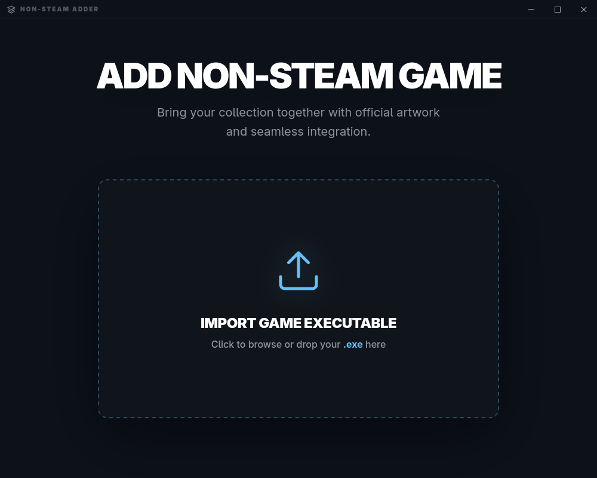
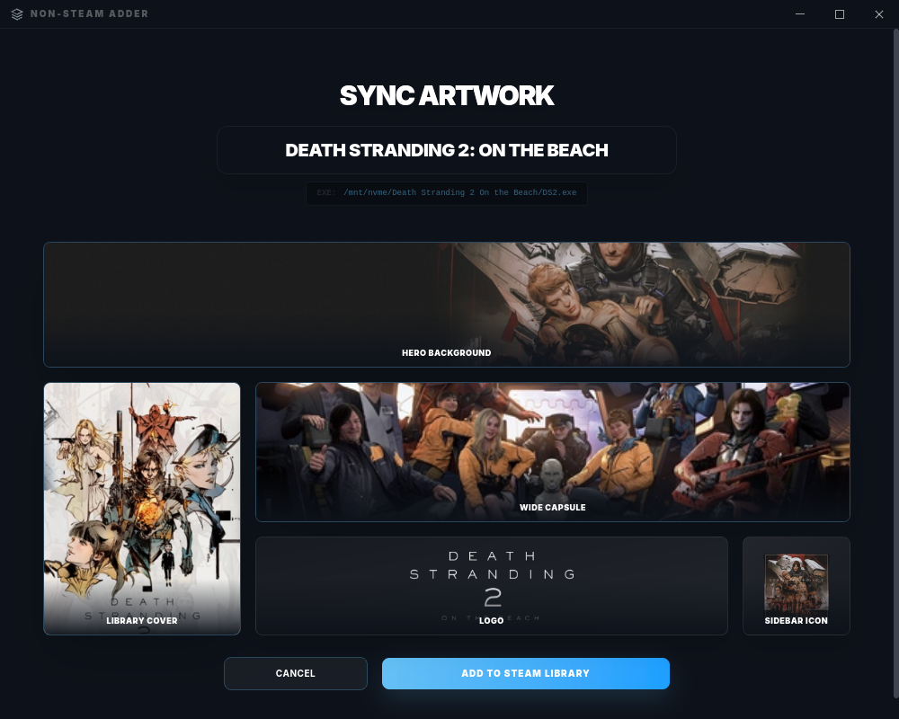

# Non-Steam Adder

A sleek desktop application to bring your DRM-free games into your Steam library with official artwork and seamless integration.

  
  

## Features

- **Easy Import**: Drag and drop your `.exe` files or browse to add them.
- **SteamGridDB Integration**: Automatically search and download professional artwork (Covers, Heroes, Logos, Icons).
- **One-Click Sync**: Inject games directly into your Steam shortcuts with all assets configured.
- **Steam-Inspired UI**: A beautiful, responsive interface designed to feel right at home with your Steam library.

## Technologies

- **Frontend**: SolidJS + Tailwind CSS
- **Backend**: Tauri + Rust
- **APIs**: SteamGridDB

## How to use

1. Open the application.
2. Select or drop a game executable (`.exe`).
3. The app will automatically search for the game on SteamGridDB.
4. Review or pick alternative artwork from the gallery.
5. Click "Add to Steam Library".
6. Restart Steam to see your new game with its fresh artwork.
